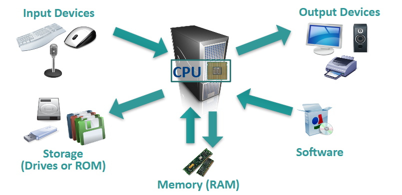

---

# Learning objectives

* Understand the internal components of a computer

    * Basic computer concepts and terminology

    * Common security issue types

* Understand operating system purpose, types, and security

    * Purpose and use of operating systems

    * Major operating systems

* Understand the basics of virtual computing

    * Provide overview of virtual machines, terminology, use, and architecture

    * Describe basic security risks for virtual computing (hypervisor, hosts, guests)

* Gain a broad understanding of major networking components and concepts

    * Overview of basic network types, concepts, and terms/definitions

    * Cisco Networking Academy

---

# Section 1

### How Computers Work

---

# Computer Anatomy 101

* The central processing unit (CPU) does the grunt work of the computer.

* Random access memory (RAM) saves your progress in many different software programs so that you can access that temporarily saved data later on. RAM is temporary. It is wiped when you turn off the computer.

* Storage allows use to save data more permanently. Read-only memory (ROM) is read-only and does not change often.

---

# Software: The BIOS

### Basic Input-Output System

* Allows the **operating system** (OS) to connect with input, output, and storage devices

* Embedded on the motherboard by the manufacturers and is a permanent piece of the computer

* Connects the CPU with the OS so the computer can boot up

* Manages basic system settings like date and time and power management

---

# Software: Operating System

* **Examples:** Microsoft Windows, Linux, Mac OS X

* Coordinates system resources so it performs and responds predictably for the user

* Allows users to configure the computer’s resources without making permanent changes to them

* Uses graphical user interface to make it easier for non-technical users to use navigate the system

* Manages the hardware/software resources so they are used efficiently by applications

---

# Major Operating System Families

* Microsoft Windows

    * Most commonly used operating system

    * User-friendly and used in offices and homes

    * Examples: Windows 8, Windows 10

* Linux

    * Often open-source, meaning that anyone can use or modify Linux operating systems or software

    * Many different “flavors” or significantly varied operating systems

    * Examples: Ubuntu, Debian, Mint, Fedora

* Mac

    * Distantly related to Linux operating systems

    * Generally more secure than Windows because malware is less likely to target non-Windows systems

    * Examples: OS X Lion, OS X Yosemite

---

# Software: Applications

* Perform tasks to benefit the user

* Apply computer resources to a specific purpose designated by the user

* Often designed for a particular type of organization

* Sometimes bundled with the OS

---

# Section 2

### Virtual Machines

---

# What is a VM?

* A virtual machine (VM) is an environment, such as a program or operating system that does not physically exist, but is created within another environment

* Does not have hardware, a power supply, or other resources that would allow it to run on its own

* Essentially allows you to run a computer within your computer

---

# VM Terminology

* **Host [operating system]:** The OS on the physical computer on which the VM is installed

* **Guest [operating system]:** The OS the VM runs

* The Host OS and Guest OS do not need to be the same

* **Image:** Another term for VM

* **Hypervisor:** software that can create and run virtual machines (example: VMware Workstation Player)

---

# VM Advantages

* **Flexibility**

    * Run multiple OSes on one physical machine

* **Scalability**

    * Run multiple VMs on the same computer

* **Portability**

    * Easily transfer VMs to different computers

* **Cost**

    * Save time testing new programs or configurations on a VM rather than disrupting the host

    * Run multiple systems on the same computer (save hardware costs and floorspace)

---

# VM Disadvantages

* Performance depends on host machine’s hardware

* Single point of failure

    * If the host fails, progress on VM is lost

* Running VMs pulls hardware resources from host machines

---

# VMware Workstation Player

* A software program used to create and run VMs

* Used to run CyberPatriot competition images

* VMware images contain several files that **should not be modified:** 

    * ***.vmdk:** virtual disk files

      * Simulate the hard drive for your virtual system
    
    * ***.vmx:** configuration files

      * Contain details such as the type of hardware to simulate for the virtual system and the amount of memory to allow the VM to use

    * ***.nvram:**  VM’s BIOS files

---

# Checksums

* A mathematical calculation based on the data contained in a file 

* Comparing the checksum of a program you downloaded to the checksum it is supposed to have will allow you to determine if the file has been corrupted or modified

* Before each round, CyberPatriot teams must verify the checksums of the competition images to make sure the images downloaded correctly

---

# Opening an Image

* Open Vmware Workstation Player                    

* Click “Open a Virtual Machine”

* Browse for and open the **.vmx** file in the image folder you downloaded

* Click “Play virtual machine”

* Select “I copied it”

* Click “OK” on Removable Devices pop-up

* Log into the user account specified in the StartEx email if not automatically logged in

---

# Section 3

### Network Basics

---

# Networking Basics

*  **Servers:** Computers dedicated to managing shared resources

* **Switch:** Controls traffic within a network

* **Router:** Controls traffic between networks

* **Firewall:**  Screen incoming and outgoing traffic for anomalies and potential threats

