# UNIT 1
# Introduction to CyberPatriot and Cybersecurity
---
## Learning Objectives
- **Understanding of the CyberPatriot competition.**
    - Overview
    - National Finals Competition
    - Team Structure
    - Scoring
    - Timeline
- **Broad understanding of cybersecurity and its importance in everyday life**
    - Cybersecurity in Everyday Life
    - Cybersecurity in the World
    - Cybersecurity Careers
---

# Section 1

## The National Youth Cyber Defense Competition

### What is CyberPatriot?

- **The National Youth Cyber Education Program**
    - National youth Cyber Defense Competition
    - AFA CyberCamps
    - Elementary School Cyber Education Initiative
    - Cyber Education Literature Series
    - Cyber Generations – Senior Citizens Cyber Safety Initiative
    - Tech Caregiver Program
    - Not hacker training
- **Offensive behavior is not allowed**
- Fun way to learn useful skills 
   - Technical skills
   - Teamwork
   - Critical thinking

## The National Youth Cyber Defense Competition

- Coach registers team(s)
- 2-6 students per team
- Optional technical mentor

- 10 online training modules
- 3+ online competition rounds

- Scored on remediation of cyber vulnerabilities and knowledge of secure networking.
- Top teams advance to Semifinals and National Finals

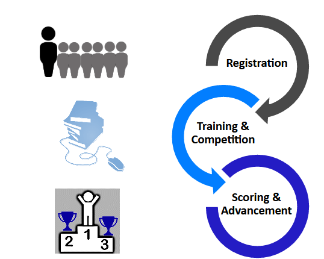

## Team Structure

- **Coaches are the administrative lead of the team**
    - Supervise students
    - Are the main point of contact for CyberPatriot Program Office
    - Ensure integrity of the competition
    - Train teams for competition (if technically savvy)

- **Technical Mentors volunteer to help Coaches train teams**
    - Use industry expertise to teach students about cybersecurity
    - Guest lecture or work with team(s) on a regular basis

- **Team Assistants volunteer to provide non-technical support and encouragement to the team**

- **Competitors work together to find and fix vulnerabilities in a simulated computer system and build secure virtual networks**

## Scoring

- **Earn points by fixing vulnerabilities in a virtual machine (VM*), answering forensic questions, networking quiz questions and building secure virtual networks**
    - Virtual machines (aka “images”) are software programs that simulate computer systems
    - Short quizzes are based on assigned materials
    - Virtual networks are built with Cisco’s Packet Tracer program
- **Lose points for making the system less secure**

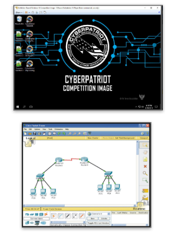

## Train & Prepare

- **READ scheduled competition round challenges on CyberPatriot website**
- **TRAIN with training materials, operating systems, and Cisco Networking assignments prior to rounds**
- **PARTICIPATE in the unscored rounds**
    - Exhibition Rounds
    - Training Rounds (answer keys provided)
    - Practice Rounds
- **PREPARE hardware, software, and network for competition to technical specifications on CyberPatriot website**
- **DOWNLOAD password-protected competition images from links in the download instructions email**

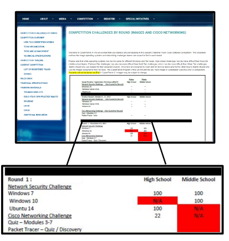

## Competing

- **EXTRACT and open images with password provided in StartEx email**
- **IDENTIFY team with Unique ID**
- **FIX Harden your system and defend against outside attacks by starting with hints and the scenario in the ReadMe file on the desktop (Score, Compare, Login, Open, Ask)**

- Not all vulnerabilities are scored or hinted at in the ReadMe
    - The goal of the competition is to harden the system as completely as possible in the provided time
    - You might do something that improves the system, but does not earn your team points

## Scoring - How to Score

- Prepare – read scheduled competition round challenges on CyberPatriot Website
- Study operating systems and Cisco Networking assignments
- Harden your system and defend against outside attacks by starting with hints and the scenario in the ReadMe file on the desktop

## CyberPatriot Competion System (CCS)

- The CyberPatriot Competition System (CCS) automatically transmits your team’s progress in the competition image (VM) to the CyberPatriot scoring server
- Use the CyberPatriot Scoring Report to check your score and your connection status
- A chime will play when you gain points and a buzzer will sound when you lose points
- Do not open, modify, or delete anything in the “CyberPatriot” folder of any image
    - Doing so could cause you to lose your progress in the image

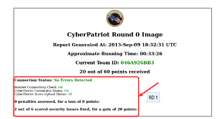

## Competition Deployment

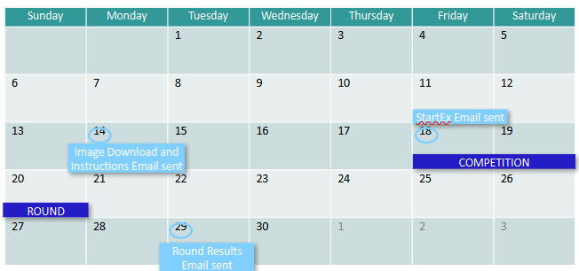

- Competition emails are only sent to registered Coaches
- Image Download and Instructions email includes download links and thorough instructions for the round.
- StartEx email contains password to unzip images and log into user account.
- Teams choose a six-consecutive-hour window during the competition weekend to compete. Six-hours must fall between support times posted by CPOC.
- Later rounds have a Preliminary Results email sent to Coaches for review prior to general score release

## CyberPatriot Example Timeline

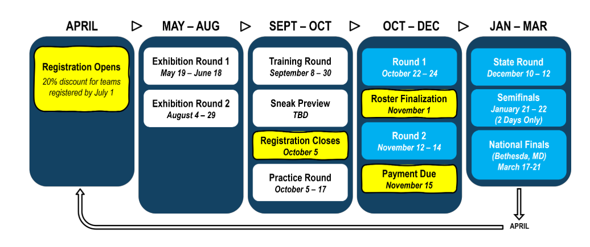

## The National Finals competition

- Top teams earn all-expenses-paid trips to the District of Columbia metropolitan area
- More than just competing in front of a computer
    - National Finals includes the Network Security Master Challenge, Cisco Networking Challenge, an AT&T Component and other additional components
- Opportunity to win scholarships, network with industry leaders, and enjoy media recognition

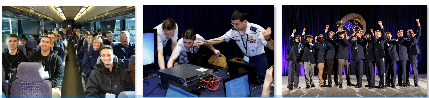

---
# Section 2

## Introduction to Cybersecurity

### What is Cybersecurity?

- All the tools we use and actions we take to keep computers, networks, and information safe and available for those who need it, and unavailable for those who should not have it.

- That means protecting hardware 
and data from everything from 
hacktivists to earthquakes.

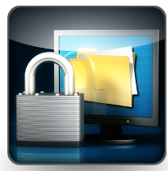

## Why is Cybersecurity Important?

- Banks
- Social Media
- Schools
- Airlines and Railroads
- Stores
- Police and fire departments
- Military and government systems
- Doctors’ offices

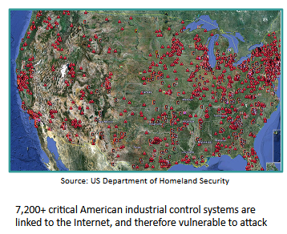

Cybersecurity isn’t just about protecting computers.
Almost everything relies on or could be affected by a computer.

## Why is Cybersecurity Important?

- There are 16 Critical Infrastructure Sectors whose assets, systems, and networks are deemed so essential that if compromised or destroyed there would be existential effects on national security, national economics, and/or public health. 
    - Cybersecurity & Infrastructure Security Agency (CISA) listed the following as Critical Infrastructure Sectors:  
        **1)** Chemical Sector

        **2)** Commercial Facilities Sector

        **3)** Communications Sector

        **4)** Critical Manufacturing Sector

        **5)** Dams Sector

        **6)** Defense Industrial Sector

        **7)** Emergency Services Sector

        **8)** Energy Sector

        **9)** Financial Services Sector

        **10)** Food and Agriculture Sector

        **11)** Government Facilities Sector

        **12)** Healthcare and Public Health Sector

        **13)** Information Technology Sector

        **14)** Nuclear Reactors, Materials and Waste Sector

        **15)** Transportation Systems Sector

        **16)** Water and Wastewater Systems Sector

## Why is Cybersecurity Important

- **2006:** 26.5 million veterans’ personal information is compromised after the theft of a Veteran Affairs employee’s laptop. The employee thought it was safe to bring home VA records on an unsecure drive.
- **2009:** Coca-Cola executive clicks link in spoof email allowing attackers to steal confidential files on $2.4 billion business deal with Chinese juice company.
- **2011:** DHS plants USB drives and CDs outside of government and government contractor buildings.  The majority are picked up by employees and inserted directly into their organization’s computers.  
- **2021:** One of the United States Critical Infrastructures was compromised, the Colonial Pipeline breach. The pipeline was used to carry gasoline and jet fuel to the Southeastern U.S. Colonial Pipeline suffered from a ransomware attack that compromised computers and equipment that managed the pipeline.

People make mistakes, as noted in the 2011 incident.  Cyber education is the best way to combat such incidents. Cybersecurity is often about protecting organizations and individuals from themselves.

## Why is Cybersecurity Important

Case: Backoff Malware Attacks targeted cash registers and payment systems sold by seven different companies
Impacted major retail companies like Target, Dairy Queen, and UPS

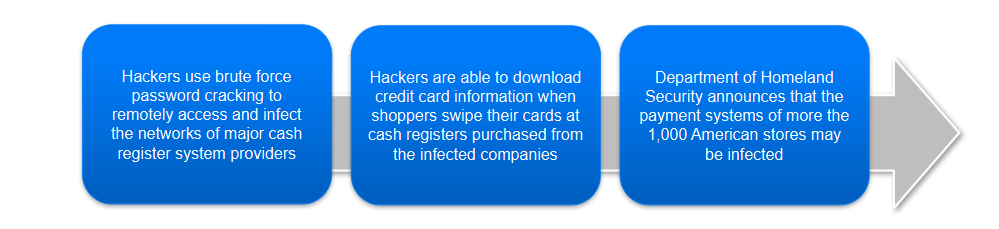

## Who's Hiring?

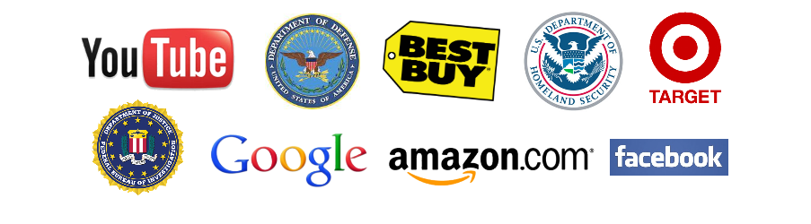

- Nearly every organization needs cybersecurity professionals
- Cybersecurity jobs are better paid than computer jobs in general.  In 2018 the average computer job paid ~$90,000.  People in cybersecurity-specific jobs earned an average salary of over $100,000.

## Cyber Career Opportunities

**1)** Security Software Developer: software is often not built with security in mind. The Security Software Developer designs and integrates security into every aspect of the software development lifecycle. 

**2)** Security Architect Career Path:  Create and build secure networks and computers for complex security frameworks.  This is an ideal career path for the problem solver who enjoys solving puzzles. 

**3)** Security Consultant:  Experts that evaluate cybersecurity threats, risks and problems to guide organizations in providing protection solutions. This is a very tech-savvy position. 

**4)** Information Security Analyst:  Professionals that stand at the front line of defense for networks. They create and maintain firewalls and monitor network activities. 

**5)** Ethical Hacker: Are licensed professionals that try to hack a network with permission to find vulnerabilities. The try to find what is vulnerable and could be exploited by a malicious hacker. 

**6)** Computer Forensics Analyst: Professionals that focus on cyber crimes and partake in data recovery, intercepting data linked to crimes, and a detailed look into data trails. 

**7)** Chief Information Security Officer:  Mid Executive position that oversees an organization’s IT department. They are responsible for planning, managing, and directing all computer, network and data security needs. 

**8)** Penetration Tester: Highly skilled professionals that are typically ethical hackers and try to infiltrate a corporation's security measures (physical and electronic) with permission from the corporation. A penetration tester will use social engineering tactics to test the security of a company's employee practices. 

**9)** IT Security Consultant:  Are typically outsourced contractors that advise organizations on cybersecurity objectives. They typically service smaller businesses on tighter budgets. 

**10)** Security Systems Administrator: The person in charge of daily operations for security controls ( installing, administering, maintaining, and troubleshooting) to include backing up data, network monitoring, user account management, and general security needs. 

## Important Resources

These training materials are only intended to provide basic training for the competition. Coaches and Mentors can be great resources, but the below links may help as well:

- The CyberPatriot Rules Book
    - Click here: http://www.uscyberpatriot.org/competition/rules-book
- Additional Windows resources
    - Click here: http://www.uscyberpatriot.org/competition/training-materials/windows 
- Additional Linux resources
    - Click here: http://www.uscyberpatriot.org/competition/training-materials/linux 
- Ubuntu practice images and Windows scoring engine provided by Texas A&M Corpus Christi
    - Click here: http://www.uscyberpatriot.org/competition/training-materials/practice-images
- Cisco Networking Academy available to (CyberPatriot program participants)
    - Click here: https://www.uscyberpatriot.org/Pages/Announcements/Cisco_Netacad_Courses.aspx