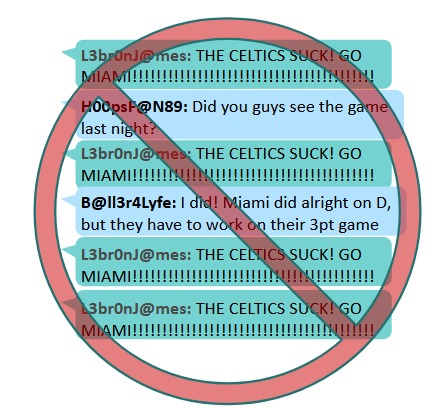
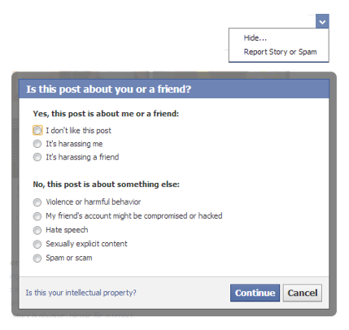
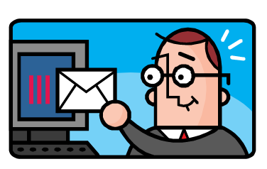
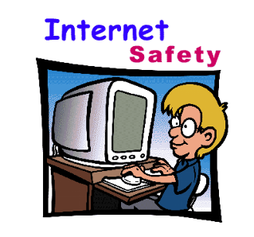
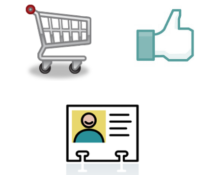
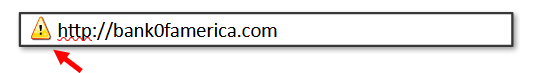
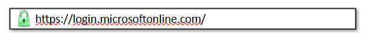
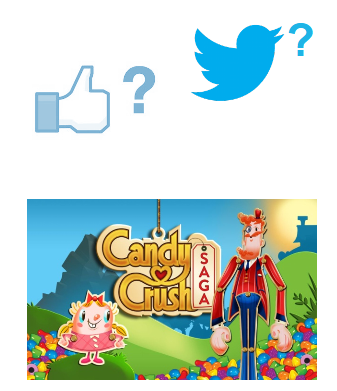

### Introduction to Online Safety
---
# Learning Objectives
 * Understand the definition and context of cyberbullying

   - Dealing with cyberbullying

   - Reporting cyberbullying

 * Understand what makes certain types of information private or more sensitive than others

* Gain an understanding of how to protect themselves online and appropriately use the Internet

   - Safe browsing

   - Social media tips

# UNIT 2 -SECTION 1 
## Cyberbullying

-------

# Netiquette

   - Do not spam forums, chat rooms, or social media sites with useless or repeated information

   - Do not pretend to be someone else

   - Do not post or distribute illegal material

   - Do not use abusive or threatening language

   - Do not try to obtain personal info about someone

   

--------
# Cyberbullying

   - Bullying refers to any unwanted, aggressive behavior

   - Cyberbullying refers to any bullying that takes place through use of electronic technology
   
   <ul>
      <li> Forms: </li>  
       <li> Insulting texts or emails </li>  
       <li> Fake profiles </li>  
       <li> Embarrassing photos or videos </li>  
       <li>  Affects 29.2% of students every year and the number is growing </li>  
   </ul>

# Why its harmful:

   - Anonymous

   - Can be done 24/7
   
   

---------

# Cyberbullying: If it Happens to You

   - Do not respond to any messages, posts or emails that you do not know who they are from

   - Block offenders

   - Document and report the behavior so it can be addressed

   - Flag the content so other people arent hurt by it

   

---------

# Reporting Cyberbullying

  <ul>
      <li> To schools:</li>  
   </ul>
   <ol>
       <li>Inform your school of any cyberbullying as you would with other types of bullying </li>  
       <li>Provide screenshots or records of bullying </li>  
       <li>To your parents and law enforcement, especially if it involves any of the following:</li>  
       <li>Threats of violence  </li>  
       <li> Explicit messages or photos </li>  
       <li>Taking a photo or video of someone in a place where he or she would expect privacy</li>  
       <li> Stalking and hate crimes </li>  
   </ol>

---------

# UNIT 2 – SECTION  2

- Personally Identifiable Information & Online Safety

---------
# Personally Identifiable Information (PII)

- PII is any information specific to an individual

- Examples:

- Student ID Number

- Date of Birth

- Email Address

- Mailing Address

- Credit Card Information

- Social Security Number

- PII can be used by hackers to steal someones identity, bank funds, etc. 

- Hackers also use PII to impersonate victims in order to gain access to a different person or an organizations network

- This type of information should only be shared with trusted, verified individuals

---------

# Online Safety: The Basics

- Never share your password

- Only share PII when absolutely necessary

- Do not download any suspicious or unknown software

- Always log out when you are done

- Do not click on links from unsafe or unknown sites or emails

- Never post anything you do not want public

- You might think youre being safe and limiting your posts to only friends, but anything you post can be easily copied and pasted and sent to someone else
If youre unsure about anything you do online, ask your parent or guardian if its OK

---------
# Risk Sites

- Online Shopping

- Social Media

- Any other website that requires Personally Identifiable Information (PII).

- These sites are enjoyable and useful. Just make sure you are being extra careful when visiting them.

- Look for secure connection protocols, such as https://

---------

# Safe Browsing

###### Do not use public Wi-Fi to access risky sites

###### Check the address for spoofs

#### Use a secure website, especially when submitting PII

- Look for an "s" after “http” in the web address

- Look for a ‘padlock’ in the browser address bar

- Look for a green background or green text

---------
# Browser Tools

- Use automatic updates

- Use and regularly update built-in safety features

- Pop-up blockers

- Anti-spyware

- Do not use “Save Password” or “Remember Me” functions

- Do not install unsecure or unknow browser extensions or plug-ins.

- Internet Explorer is more frequently targeted and has more security flaws than any other browser

- Anti-virus

- Anti-phishing

---------

# Social Media Tips

- Be picky

- Only accept or follow friends you know in real life

- Do not post your location

- Be careful with apps 

- Games and geo-tracking apps may give away your location or other PII

- Assume everything you post online is permanent 

- Colleges and employers check social media accounts

- Dont over-share

- Just because a site asks for information doesnt mean its required to set up an account

- Customize and update your security settings

- Default settings are weak

 
