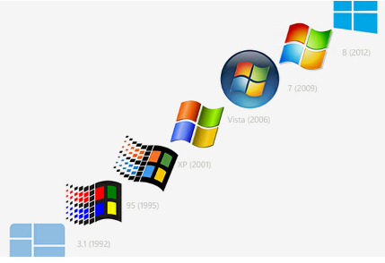
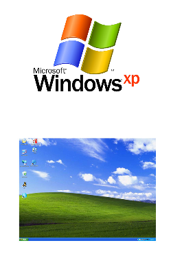
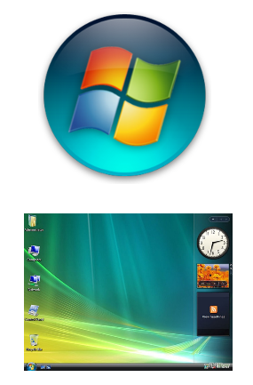
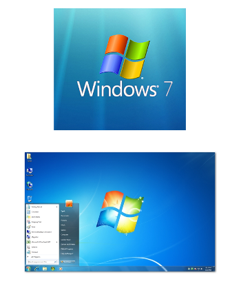
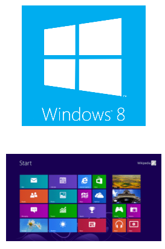
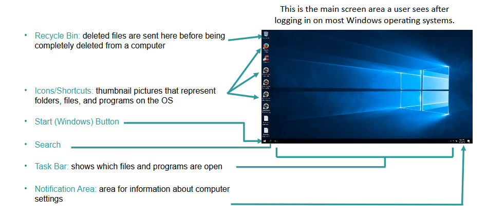
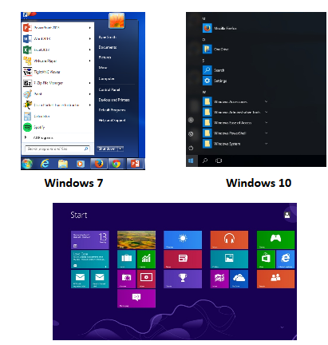
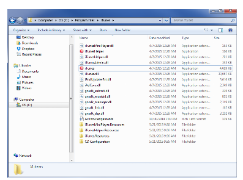

# UNIT 6
# Microsoft Windows Basics
---
## Learning Objectives
- **Participants will understand what the Microsoft Windows operating system is and its basic history.**
    - Windows OS Basics
    - Windows Version History
    - Windows-Specific Terms and Definitions
---
# Section 1

## Windows Version History

### Version History
- First version of Windows widely released was MS-DOS in 1981
- New workstation and server versions are often released around the same time and are closely related.
- Only OSes that have been used in the
competition will be covered.
- Windows 10 and Server 2016 are not
listed, though they were used in the 
competition.

*Desktop Image*

## Windows XP and Server 2003

Release Dates: 2001 (XP) and 2003 (Server 2003)

Major Features
- Lightweight – Only requires 64 MB of RAM and 1.5 GB of hard drive space
- Focus on user eXPerience – sleek graphics, simplicity, and basic features
- XP has been updated with three Service Packs and Server 2003 has two
- XP is the first version to include Remote Desktop, which allows a user to connect to a system remotely

Notable Security Concerns
- In 2014, Microsoft discontinued support and updates for Windows XP and Server 2003, meaning systems running those - OSes may now be more vulnerable to attack.
- Almost 250 million people still use Windows XP
- Many systems running these OSes may also have outdated hardware and applications that also have security concerns.

*Desktop Image*

## Windows Vista and Server 2008

Release Dates: 2006 (Vista) and 2008 (Server 2008)

Major Features
- Updated GUI and a Windows Sidebar where users can place Desktop Gadgets, like weather and time applets
- Windows Defender – security tool featuring antispyware capabilities
- Backup and Restore Center – allows users to more efficiently back up files and create system images
- User Account Control (UAC) – informs user when a program requires administrator-level permission
- Bitlocker – Full disk encryption
- Vista and Server 2008 each have two Service Packs 
Notable Security Concerns
- Vista included major architectural changes, making it significantly more secure than base Windows XP.
- While UAC is a useful security tool, it caused major usability issues for the average user.

*Desktop Image*

## Windows 7 and Server 2008 R2

Release Date: 2009 (Both)

Major Features
- Significant speed improvements that Vista lacked due to bloated OS size
- Windows 7 and 2008 R2 each have one Service Pack
- Improved searching and more nuanced UAC, which provides the ability to slide between different security levels
- Action Center – centralized location to notify user of major security issues
- Windows now allows for biometric authentication
Notable Security Concerns
- Initial launch only had minimal security fixes over Vista.
- As the most widely used OS, Windows 7 is the most targeted by malicious users and software.

*Desktop Image*

## Windows 8 (8.1) and Server 2012

Release Dates: 2012 (Windows 8 and Server 2012) and 2013 (Windows 8.1)

Major Features
- Focus on providing an OS for tablets, including touchscreen and gesture capabilities, a tiled Start screen Windows Store, and “hot corners”
- Windows 8.1 returned the Start button that was missing in Windows 8
- Windows Defender now includes Microsoft Security Essentials, which provides antivirus support
- Cloud Storage and Sync – users can now sync their settings and backup their data to the cloud
Notable Security Concerns
- Some applications were rewritten to maintain compatibility with the new GUI, which could lead to new security flaws.
- “Picture passwords” can be more easily cracked than traditional passwords.

*Desktop Image*

---
# Section 2

## Windows Basics

## Microsoft Windows: Desktop

## Microsoft Windows: Start Menu and Start Screen

- All Windows OSes until Windows 8 included a Start button in the task bar
- Clicking the Start button brings up the Start Menu
- From the Start Menu, users can search their system, open files and programs, and access system tools
- Windows 8 did not have a Start button and replaced the Start Menu with the Start Screen
- Windows 8.1 brought the Start button back to take users to the Start Screen

## Microsoft Windows: Directory

- Files and folders can be accessed through Windows Explorer
- A file path is where a file is located on a system
- Example file path:
    - C:\Program Files\iTunes\iTunes.exe
        - C:  - Drive
        - \Program Files – Folder
        - \iTunes - Folder
        - \iTunes.exe - File

## Microsoft Windows: File Extensions

- A group of letters occurring after a period in a file name, indicating the format of the file
- Common file extensions in Windows:

    - .bat – executable batch files
    - .bmp – Bitmap graphics files
    - .doc – Word documents (pre-Office 2007)
    - .docx – Word documents (Office 2007 and later)
    - .exe – executable files/programs
    - .ppt – PowerPoint files (pre-Office 2007)
    - .pptx – PowerPoint files (Office 2007 and later) 
    - .wav – Microsoft audio file
    - .wmv – Windows Media Video
    - .xls – Excel spreadsheet (pre-Office 2007)
    - .xlsx – Excel spreadsheet (Office 2007 and later)